# Nectar - Flutter E-Commerce UI 🛍️

[](https://flutter.dev)

A **Flutter UI project** showcasing a clean and modern e-commerce app design. This is a **frontend-only implementation** with mock data, focusing on UI/UX best practices, animations, and responsive layouts.


---

## ✨ UI Features
- **Product Catalog**: Grid/list views with product cards, filters, and search bar (static data).
- **Cart & Checkout Flow**: Interactive cart management with quantity adjustments and mock payment screens.
- **Profile & Settings**: User profile page with theme customization options.
- **Responsive Design**: Adapts seamlessly to mobile screen sizes.
- **Animations**: Smooth transitions and micro-interactions (e.g., button taps, page navigation).

---

## 🛠️ Technologies Used
- **Flutter** (Dart) - Frontend framework
- **Cubit** - State management for UI interactions
---
## Video


https://github.com/user-attachments/assets/d88b7b1f-f219-4b82-84c4-21ab74261b83


---
## Screenshots
<p align="center">
  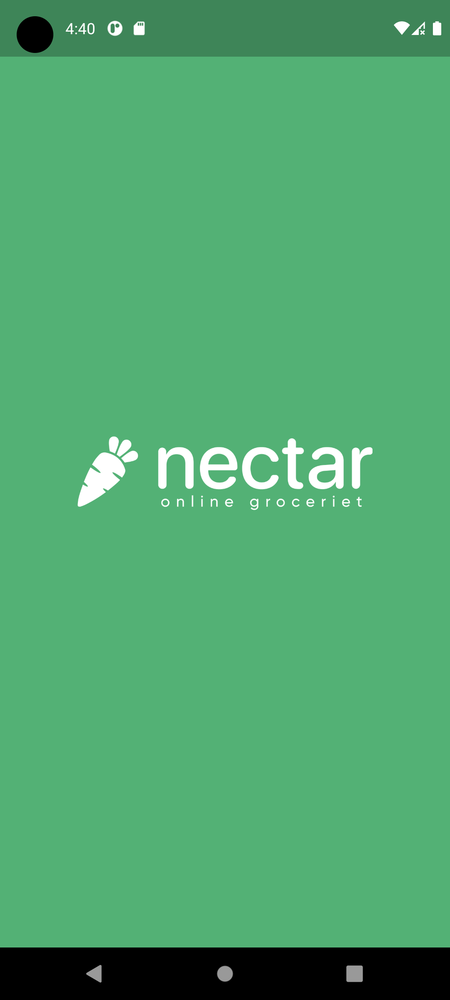
  
  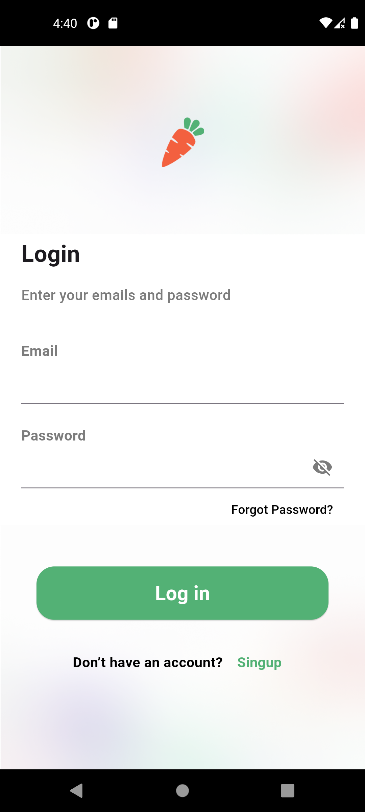
  
  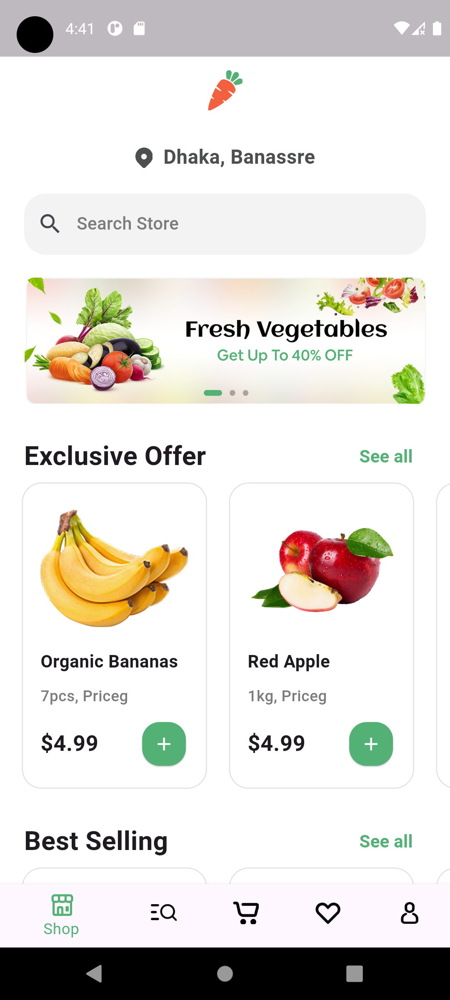
  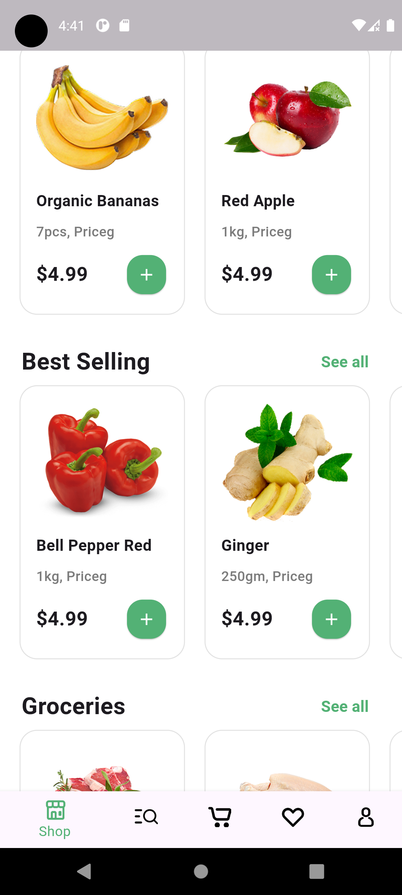
  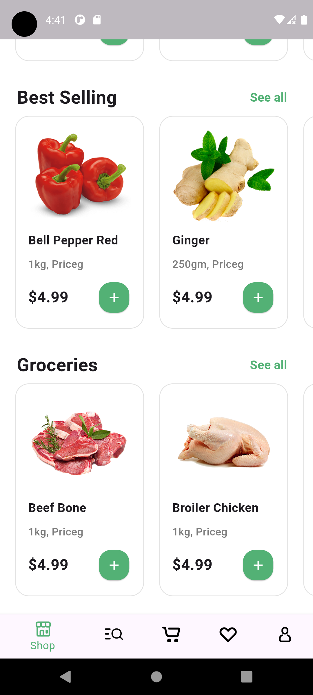
  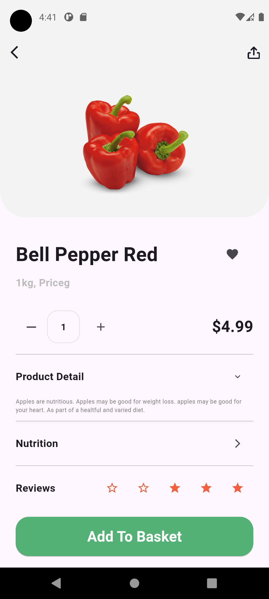
  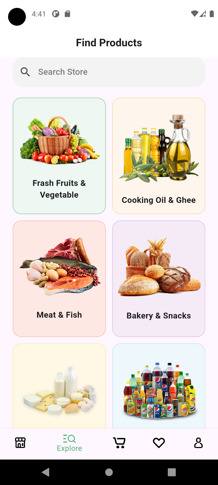
  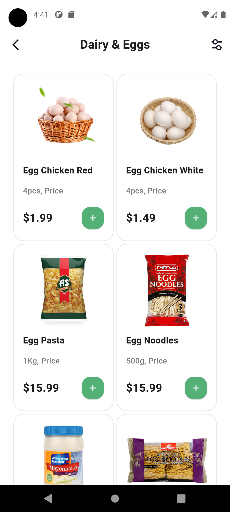
  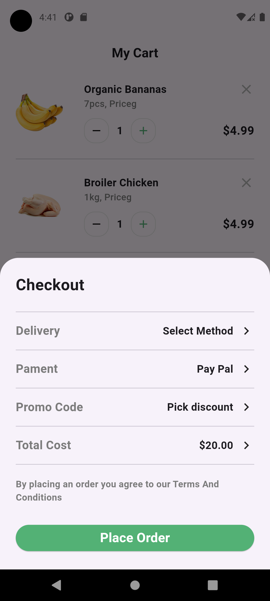
  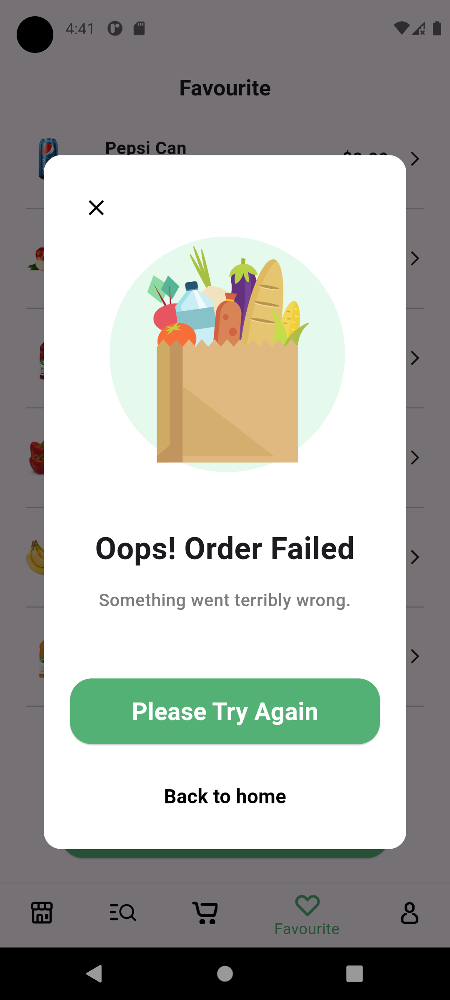
  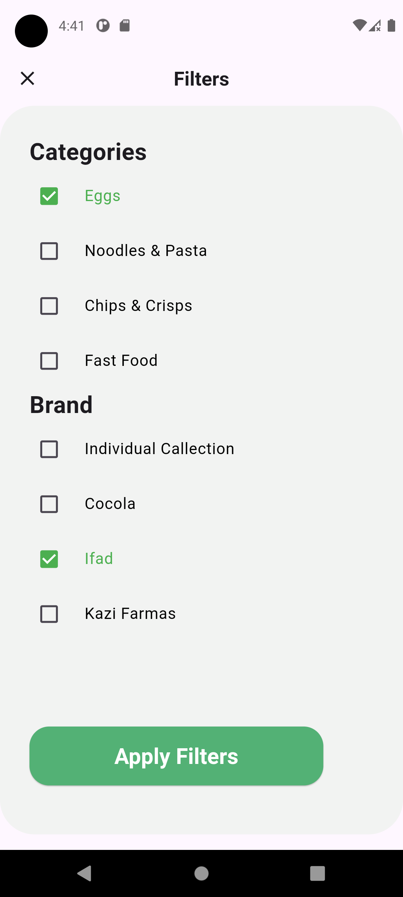
  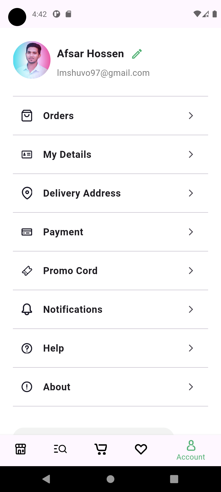
</p>


---

## 🚀 Installation
1. **Clone the repository**:
   ```bash
   git clone https://github.com/0-Hossam-0/Nectar-Flutter.git
   cd Nectar-Flutter
